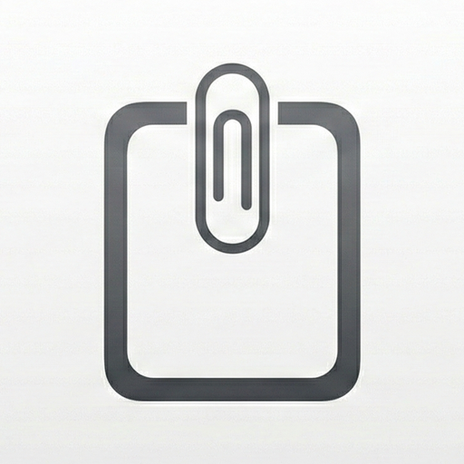

# Maclipboard

> A lightweight, fast, and minimalistic clipboard manager for macOS built purely with SwiftUI. It runs invisibly in the background, keeping track of your clipboard history, and allows you to quickly access and auto-paste previously copied items.




## ✨ Features

- **Global Hotkey Access**: Instantly bring up your clipboard history from any application by pressing `Ctrl + V`.
- **Keyboard-Driven Auto-Paste**: Navigate your history with the Up/Down Arrow keys and press `Return`, or simply click an item, to automatically paste it directly into your active window.
- **Pinning**: Hover over any clipboard item and click the Pin icon to lock your most used clips to the top of the history permanently.
- **Rich Customization**: Click the Gear icon in the panel header to access native settings:
  - **Appearance Themes**: Force Light mode, Dark mode, or inherit dynamically from the macOS System.
  - **Background Images**: Select any local photo from your Mac to automatically stretch across the panel background.
  - **Opacity & Blur Control**: Adjust the background transparency slider, and optionally toggle a frosted glass blur effect that dynamically filters your chosen background image or color.
  - **Custom Colors**: Pick a specific tint color for the panel background using the native macOS Color Picker.

## 🚀 Installation & Usage

### 1. Download Pre-built Binary (Quickest)
You can download the latest compiled `Maclipboard.app` directly from the [GitHub Releases](https://github.com/Jung217/Maclipboard/releases) page. Unzip the downloaded file and drag the application to your `Applications` folder!

### 2. Build from Source

Maclipboard is built purely natively and requires no heavy JavaScript dependencies. A convenient `Makefile` is included if you prefer to build the application from source.

#### Prerequisites
- macOS 13.0 or higher.
- [Xcode Command Line Tools](https://developer.apple.com/xcode/features/) installed. (You can install them by running `xcode-select --install` in your terminal).

#### Running the App
1. Open your terminal and navigate to the root folder of this project.
2. Run the following command to compile and launch the application immediately:
   ```bash
   make run
   ```
3. Alternatively, if you only want to build the `Maclipboard.app` bundle into the `build/` directory without launching it, run:
   ```bash
   make app
   ```
4. To clean the build directory and start completely fresh, run:
   ```bash
   make clean
   ```

## ⚙️ Troubleshooting Permissions

Because Maclipboard needs to listen for the global `Ctrl+V` hotkey while running in the background, and needs to simulate `Cmd+V` keystrokes for the Auto-Paste feature, it strictly requires **Accessibility permissions** from macOS.

**If pressing the hotkey does not open the panel, or if clicking an item does not paste it into your active app:**
1. Open **System Settings** > **Privacy & Security** > **Accessibility**.
2. Find `Maclipboard` in the list of applications.
3. Ensure the toggle switch next to `Maclipboard` is turned **ON**.

*Note: If permissions are granted but the app still isn't responding (common when rapidly rebuilding the application from source), macOS may have cached an old signature. Select `Maclipboard` in the Accessibility list, click the minus (`-`) button to remove it entirely, then run `make run` again to prompt a brand new permission dialog from the operating system.*
